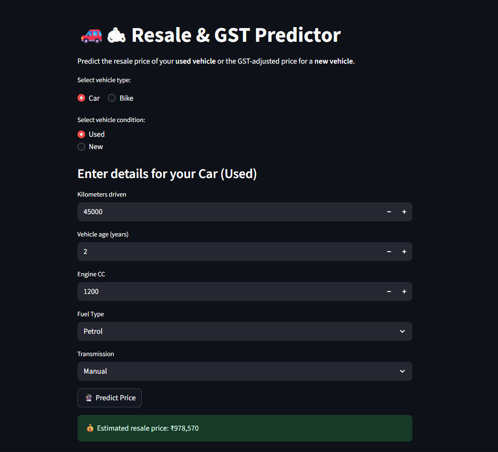
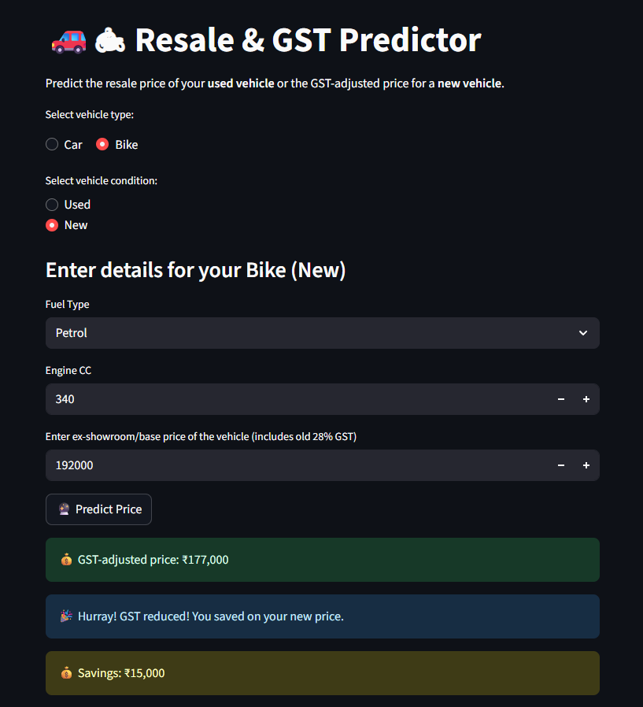
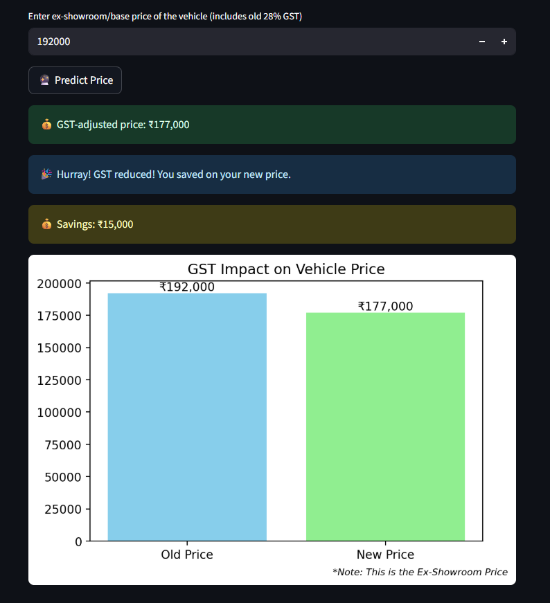

## 🚗🏍 Resale & GST Vehicle Price Predictor

## 🧾 Overview

The Resale & GST Vehicle Price Predictor predicts:
1. Resale price of used cars and bikes using RandomForestRegressor.
2. GST-adjusted price for new vehicles based on engine capacity and fuel type.

This interactive tool helps users quickly estimate vehicle prices and understand GST impacts.

## 🚀 Features

💰 Predict resale price for used cars and bikes.
📊 GST calculation for new vehicles with engine/fuel type consideration.
🖥️ Interactive Streamlit app for easy access.
📈 Visual price comparison with bar charts.
🔧 Models trained on real-world datasets.

## 🛠️ Tech Stack

- Language: Python 🐍
- ML Models: scikit-learn RandomForestRegressor 🌲
- Frontend/App: Streamlit ⚡
- Data: CSV datasets 📂
- Model Storage: .pkl files tracked with Git LFS

## 📂 Folder Structure

Resale-GST-Predictor/
├─ data/                # CSV datasets
├─ models/              # Saved .pkl models & column info
├─ notebooks/           # Jupyter notebook with full pipeline
├─ app.py               # Streamlit application
├─ requirements.txt     # Python dependencies
└─ README.md            # Project overview

## 📊 Screenshots

## 💻 Installation

=> Clone the repository:
git clone https://github.com/DevanshuGurjar/Resale_and_GST_Predictor.git
cd Resale_and_GST_Predictor

=> Install dependencies:
pip install -r requirements.txt

=> Run the Streamlit app:
streamlit run app.py

## 📝 Usage

- Select vehicle type: Car or Bike.
- Choose condition: Used or New.
- Input relevant details: kilometers driven, engine CC, fuel type, age, base price.
- Click Predict Price to see estimated resale or GST-adjusted price.
- Compare old vs new price visually with dynamic bar chart.

## 🔮 Future Enhancements

- Include additional features like brand, location, vehicle condition.
- Experiment with advanced models like XGBoost or CatBoost.
- Deploy on cloud platforms with Docker for scalability.

## 📬 Contact

For any inquiries or support, reach out to me: devanshu.happy910@gmail.com